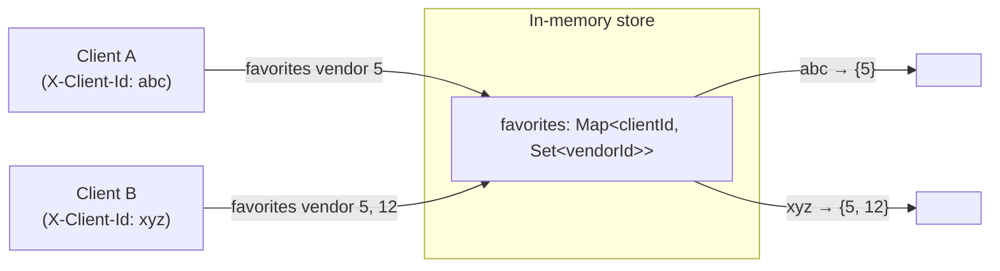
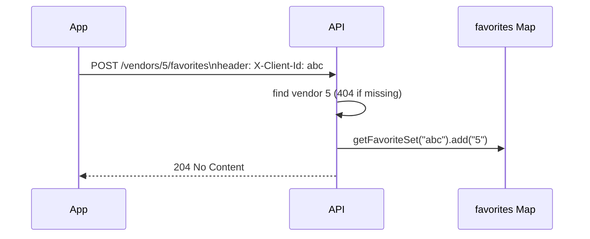
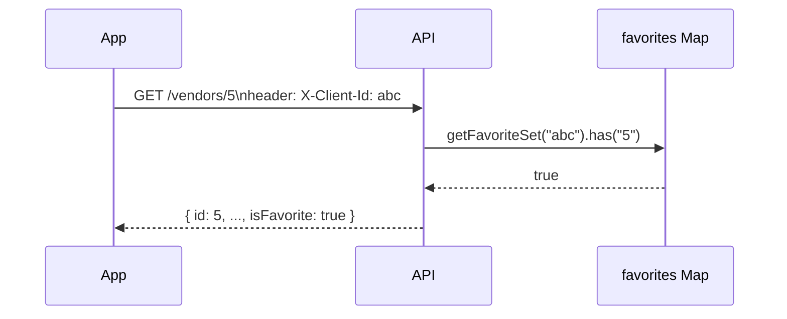

## Data Model

### Request flow — adding a favorite

### Request flow — reading a vendor with favorite status

### Favorites design

The original API stored favorites as a single boolean on each vendor
record, so toggling a favorite was visible to every client — there was
no notion of "whose" favorite it was.

**Approach:** favorites are scoped per-client using a client-generated
identifier sent as an `X-Client-Id` header (no login/accounts exist in
this app, so a persisted UUID is enough to identify "this device"
across requests).

Server-side, favorites are stored as `Map<clientId, Set<vendorId>>` —
an in-memory structure mirroring the rest of the API's data (no DB in
this project). A `Set` gives O(1) add/remove/membership checks per
client and is naturally idempotent: adding the same vendor twice, or
removing a vendor that isn't favorited, is a no-op rather than an
error.

**Endpoints:**
- `POST /vendors/:id/favorites` — add to the current client's favorites (idempotent)
- `DELETE /vendors/:id/favorites` — remove (idempotent)
- `GET /favorites` — list the current client's favorited vendors, for the Favorites tab
- `GET /vendors` / `GET /vendors/:id` — each vendor includes an `isFavorite`
  flag computed per-request against the current client's set

**Trade-off:** a header-based client id is not real authentication —
it's trivially spoofable and doesn't survive a reinstall/app-data wipe.
That's an acceptable trade-off for this challenge's scope (no backend
persistence at all, no account system), but a production version would
need real auth and a persistent store.
